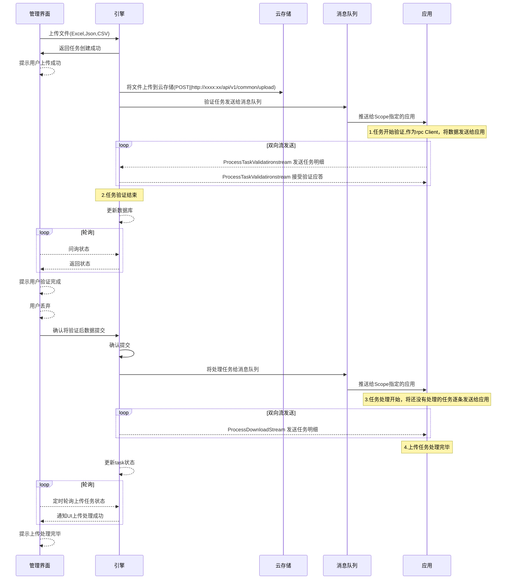
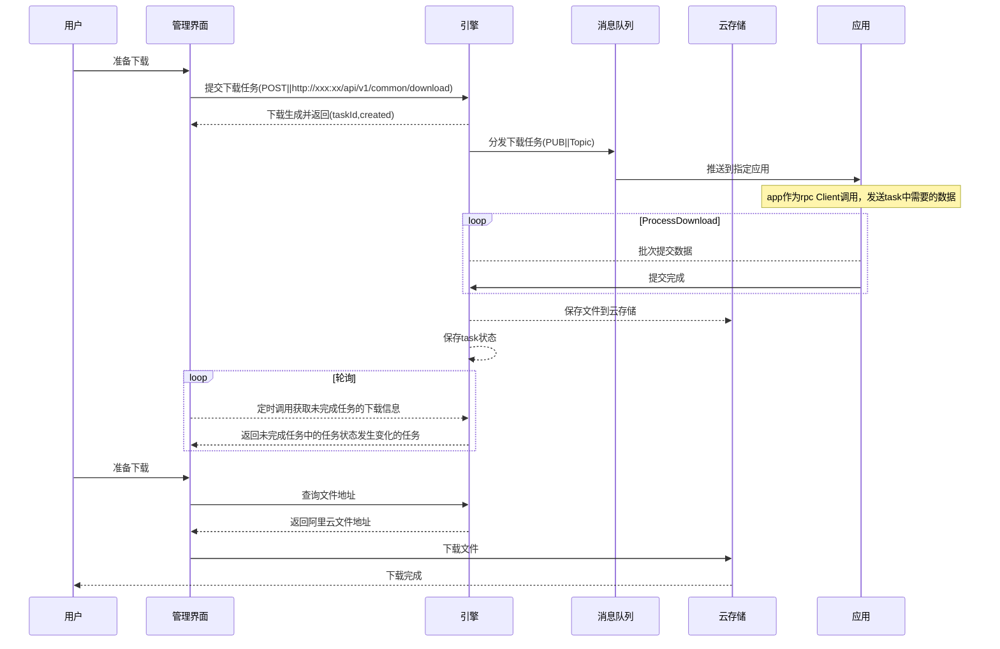

业务批量上传与数据下载调度引擎

### 设计思路
#### 上传导入

```mermaid
 sequenceDiagram
    participant ui as 管理界面
    participant irons as 引擎
    participant storage as 云存储
    
    participant mq as 消息队列
    participant app as 应用
    ui ->> irons: 上传文件(Excel,Json,CSV)
    irons ->> ui: 返回任务创建成功
    ui -->> ui: 提示用户上传成功

    irons ->>storage:将文件上传到云存储(POST||http://xxxx:xx/api/v1/common/upload)
    irons ->> mq:验证任务发送给消息队列
    mq->> app:推送给Scope指定的应用
    note over app: 1.任务开始验证,作为rpc Client，将数据发送给应用
    loop 双向流发送
        app -->> irons: ProcessTaskValidatironstream 发送任务明细
        irons -->> app: ProcessTaskValidatironstream 接受验证应答
    end
    note over irons: 2.任务验证结束
    irons -->> irons:更新数据库
    loop 轮询
        ui -->> irons: 问询状态
        irons -->> ui: 返回状态
    end
    ui-->>ui: 提示用户验证完成 
    ui-->>ui:用户丢弃
    ui ->> irons:确认将验证后数据提交
    irons ->> irons:确认提交
    irons ->> mq:将处理任务给消息队列
    mq ->> app: 推送给Scope指定的应用
    
    note over app: 3.任务处理开始，将还没有处理的任务逐条发送给应用
    loop 双向流发送
      irons -->> app: ProcessDownloadStream 发送任务明细
    end 
    note over app: 4.上传任务处理完毕
    irons-->>irons:更新task状态
    loop 轮询
        ui -->> irons: 定时轮询上传任务状态
        irons -->> ui: 通知UI上传处理成功
    end
    ui-->>ui:提示上传处理完毕
```
#### 下载生成

```mermaid
sequenceDiagram
participant user as 用户
participant ui as 管理界面
participant irons as 引擎
participant mq as 消息队列
participant storage as 云存储
participant app as 应用


user ->> ui: 准备下载
ui->> irons: 提交下载任务(POST||http://xxx:xx/api/v1/common/download)
irons-->> ui: 下载生成并返回(taskId,created)
irons ->> mq:分发下载任务(PUB||Topic)
mq->> app: 推送到指定应用
   
note over app:app作为rpc Client调用，发送task中需要的数据
loop ProcessDownload
    app --> irons: 批次提交数据
    app ->> irons:提交完成
end

irons -->> storage: 保存文件到云存储
irons -->>irons:保存task状态
loop 轮询
    ui -->> irons: 定时调用获取未完成任务的下载信息
    irons -->> ui: 返回未完成任务中的任务状态发生变化的任务
end
user ->> ui:准备下载
ui ->> irons:查询文件地址
irons -->>ui:返回阿里云文件地址
ui ->>storage:下载文件
storage -->> user: 下载完成
```
