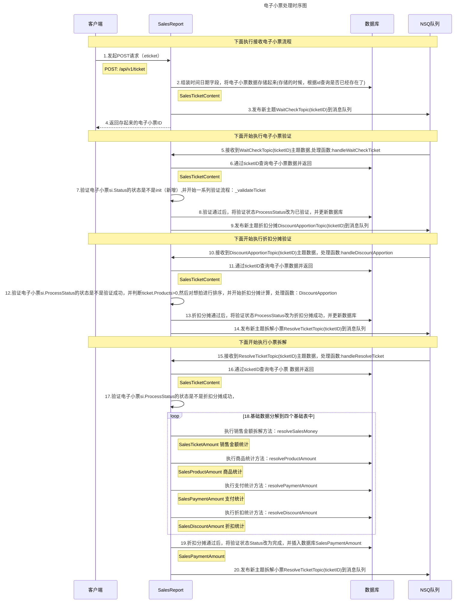
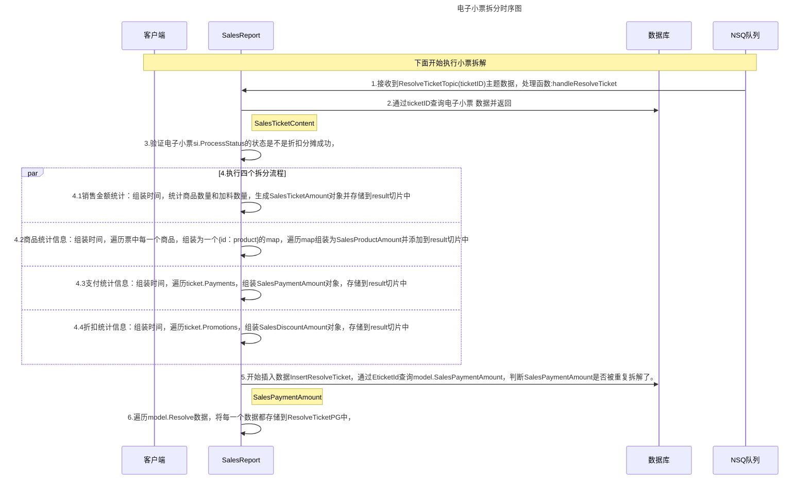
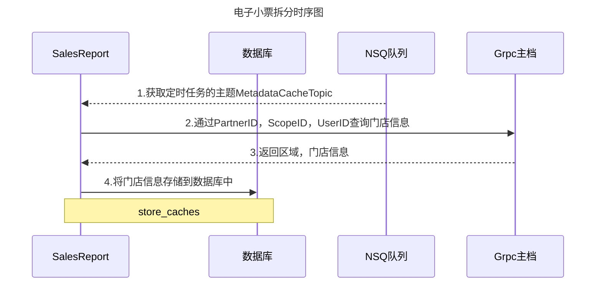
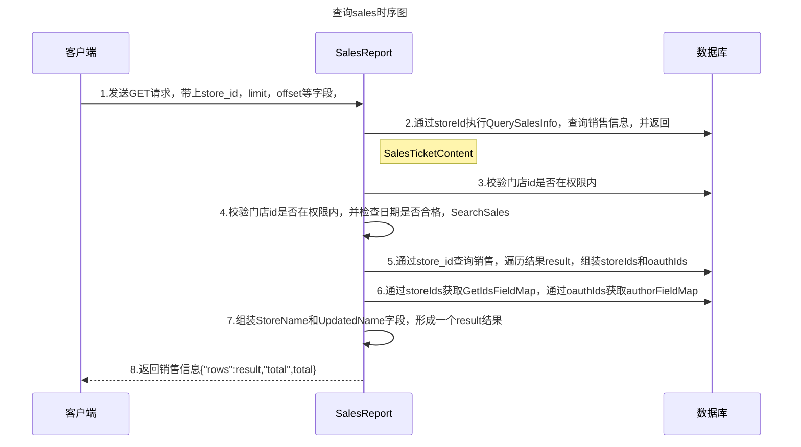
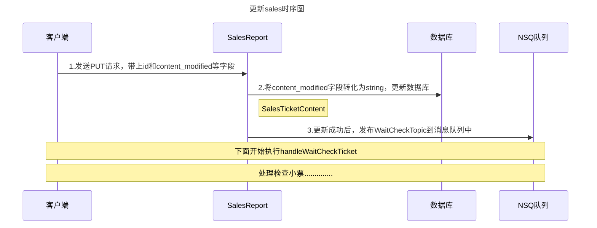
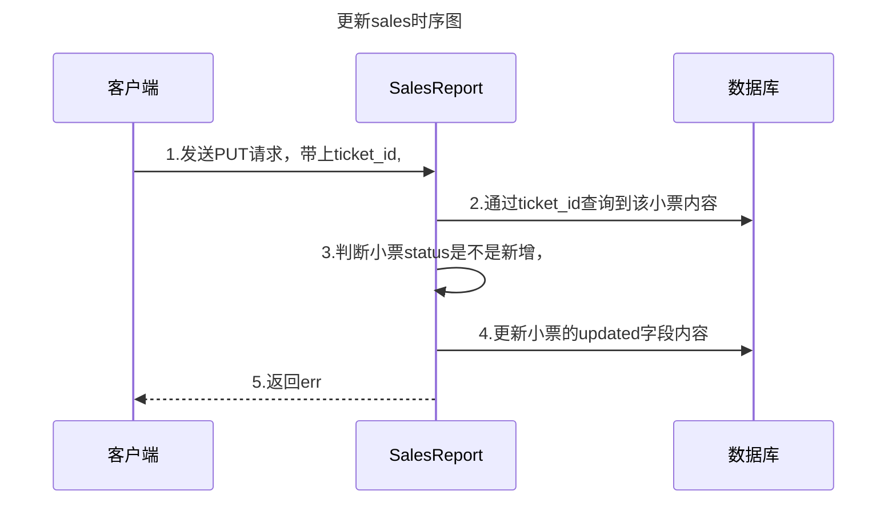
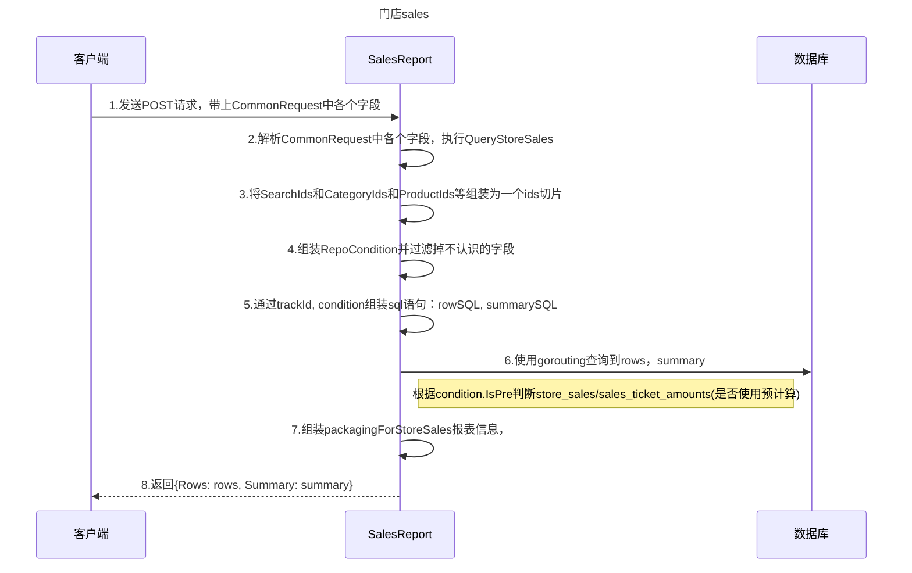
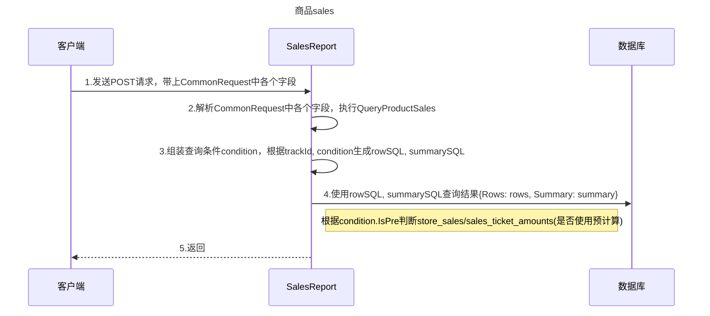
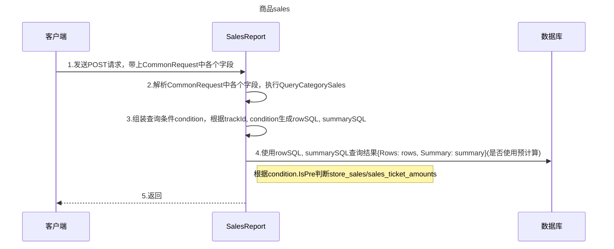

### 1.接收电子小票流程

接口：POST: /api/v1/ticket

Body：

```json
{
    "ticket":
    {
        "ticket_id": "0633231421031618453247951750022",
        "ticket_no": "0633231421031618453247951750020",
        "start_time": "2021-03-16 18:45:29",
        "end_time": "2021-03-16 18:45:29",
        "upload_time": "2021-03-16 18:45:33",
        "bus_date": "2021-03-16",
        "pos":
        {
            "id": "4467565903218929665",
            "code": "11047059",
            "device_id": "",
            "device_code": ""
        },
        "operator":
        {
            "id": "4380287224818696193",
            "loginId": "4066",
            "name": "\u6768\u5c11\u82f1",
            "code": "4066",
            "login_time": ""
        },
        "amounts":
        {
            "taxAmount": 0,
            "gross_amount": -33,
            "pay_amount": -33,
            "net_amount": -33,
            "discount_amount": 0,
            "removezero_amount": 0,
            "rounding": 0,
            "overflow_amount": 0,
            "changeAmount": 0,
            "serviceFee": 0,
            "tip": 0
        },
        "takemealNumber": "6",
        "qty": -1,
        "status": "REFUND",
        "refundInfo":
        {
            "refund_id": "0633231421031618453247951750018",
            "ref_ticket_id": "0633231421031616071539251750012",
            "ref_ticket_no": "0633231421031616071539251750012",
            "refund_reason": ""
        },
        "channel":
        {
            "source": "POS",
            "deviceType": "PAD",
            "orderType": "DINEIN",
            "deliveryType": "REALTIME",
            "tpName": "INVALID",
            "code": "10005",
            "id": "4383963285460877313",
            "mapping_code": "pos"
        },
        "products":
        [
            {
                "id": "4454238806391914497",
                "name": "\u575a\u679c\u8c46",
                "code": "4070190067",
                "seq_id": 1,
                "price": 33,
                "amount": -33,
                "qty": -1,
                "discount_amount": 0,
                "type": "",
                "accessories": null,
                "combo_items": null,
                "remark": "",
                "skuRemark":
                [
                    {
                        "name":
                        {
                            "id": "",
                            "code": "10003",
                            "name": "\u725b\u5976"
                        },
                        "values":
                        {
                            "code": "1000301",
                            "name": "\u5168\u8102\u725b\u5976"
                        }
                    },
                    {
                        "name":
                        {
                            "id": "",
                            "code": "10001",
                            "name": "\u610f\u5f0f\u5496\u5561\u8c46"
                        },
                        "values":
                        {
                            "code": "1000102",
                            "name": "\u67d1\u6a58\u9999"
                        }
                    },
                    {
                        "name":
                        {
                            "id": "",
                            "code": "10004",
                            "name": "\u676f\u578b"
                        },
                        "values":
                        {
                            "code": "1000401",
                            "name": "\u6807\u51c6\u676f"
                        }
                    }
                ],
                "taxAmount": 0,
                "category_id": "4373443971733520385",
                "category_name": "\u539f\u6750\u6599-\u751f\u8c46-\u56fd\u5bb6\u00b7\u4e2d\u56fd"
            }
        ],
        "payments":
        [
            {
                "id": "4380223798482305025",
                "seq_id": "1",
                "name": "\u73b0\u91d1",
                "pay_amount": -33,
                "receivable": -33,
                "change": 0,
                "overflow": 0,
                "rounding": 0,
                "pay_time": "2021-03-16 18:45:29",
                "trans_code": "CASH",
                "tpTransactionNo": ""
            }
        ],
        "table":
        {
            "id": "",
            "zone_id": "",
            "tableNo": "",
            "people": 0,
            "temporary": false
        },
        "people": 1,
        "room_no": "-1",
        "order_time_type": "BFAST",
        "shiftNumber": "\u6768\u5c11\u82f1",
        "taxList":
        [
            {
                "amount": 0,
                "subTotal": -33,
                "code": "3070401000000000000",
                "name": "\u9910\u996e\u670d\u52a1"
            }
        ],
        "takeaway_info":
        {
            "order_method": "",
            "tp_order_id": "",
            "order_time": "",
            "description": "",
            "consignee": "",
            "phone_list": null,
            "tp": "",
            "source": "",
            "source_order_id": "",
            "day_seq": "",
            "delivery_type": 0,
            "delivery_name": "",
            "delivery_poi_address": "",
            "invoice_title": "",
            "waiting_time": "",
            "tableware_num": 0,
            "send_fee": 0,
            "package_fee": 0,
            "delivery_time": "",
            "take_meal_sn": "",
            "partnerPlatformId": 0,
            "partnerPlatformName": "",
            "wxName": "",
            "isHighPriority": false,
            "takeoutType": "",
            "originalOrderNo": ""
        },
        "store":
        {
            "id": "4374823993522257921",
            "code": "MD031",
            "secondCode": "",
            "companyId": "",
            "partnerId": "2",
            "scopeId": "0",
            "branchId": "0"
        },
        "transaction_no": "0633231421031618453247951750018"
    }
}
```

返回：


报表接口使用的全是Grpc接口，

查询接口使用的是Http接口


### 2.总处理时序图:




### 3.拆分电子小票时序图：




### 3.1处理主档缓存的topic作用

配合定时任务使用，定时任务里面发布的就是这个主题，这里接收到这个主题，就可以定时将订单里面的门店信息和商品信息存储到缓存中，以后查询就可以使用缓存里面的数据，不用再去主档拉取数据了，提高查询效率。

```go
	if err := DefaultMQ.RegistReceive(config.MetadataCacheTopic, handelMetadataCache); err != nil {
		log.Fatalf("Init mq receive for topic `%s` failed. Err: `%+v`", config.MetadataCacheTopic, err)
	}
```




### 4.查询sales报表

接口：GET: /api/v1//tickets

返回：{"rows":result,"total",total}




### 5.更新sales数据

接口：PUT: /api/v1//tickets

返回：{"err": ""}




### 6.回滚sales数据

接口：PUT: /api/v1//tickets/rollback

返回：{"err": ""}




### 7.门店交易报表:StoreSales

POST：/api/v1/report/sales/store

Return：{"rows":result,"total",total}




### 8.单品交易报表:ProductSales

POST：/api/v1/report/sales/product

Return：{"rows":result,"total",total}



### 9.类别交易报表:CategorySales

POST：/api/v1/report/sales/category

Return：{"rows":result,"total",total}



### 10.支付统计报表:PaymentStatistics

POST：/api/v1/report/sales/category

Return：{"rows":result,"total",total}


